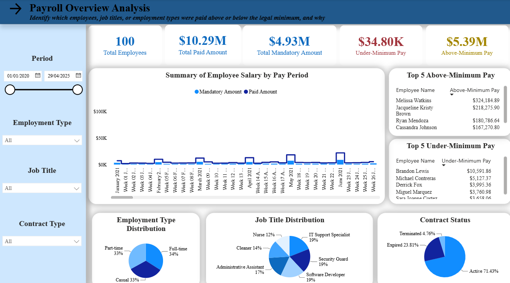
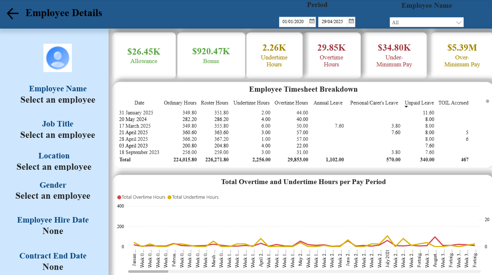

## Payroll Wage Compliance Dashboard — Award Wage & Overtime Analysis

*Turning 45,607 raw timesheet transactions into an interactive Power BI dashboard that identifies which employees, job titles, or employment types were paid above or below the legal minimum — and what's driving the gap.*

### Tools used: SQL Server (star schema, MARTS layer) · Power Query (parameterised connections, cleaning) · Power BI Desktop (multi-fact star schema, complex DAX award-wage logic, interactive two-page report)

---

### 1. Purpose of the Project

Running payroll across hundreds of casual, part-time, and full-time employees means constantly reconciling what people were *actually* paid against what they were *legally owed* — across overtime, night shift penalties, junior pay multipliers, casual loading, and paid leave. Manual reconciliation doesn't scale, and a single mislabelled metric can hide real compliance risk behind a number that only looks alarming.

This project builds a payroll analytics model on top of 45,607 timesheet transactions (~$10.29M in total pay) to answer the question that actually matters to a payroll team:

> **Which employees, job titles, or employment types were paid above or below the legal minimum so far — and what's driving the gap?**

The result is a two-page Power BI dashboard that lets payroll managers and HR compliance officers move from "here's a number" to "here's who to investigate and why."

### 2. Key Insights

#### Headline KPIs

| Metric | Value |
| --- | --- |
| Total Paid | ~$10.29M |
| Total Mandatory (Award Minimum) | ~$4.93M |
| Under-Minimum Pay | $34.80K |
| Above-Minimum Pay | $5.39M |
| Total Employees | 100 |
| Total Timesheet Transactions | 45,607 |

#### What the data revealed

- **Underpayment is heavily concentrated in the casual workforce**. Casual employees account for 93.9% ($32,673 of the total $34,804.20) of all underpayment, despite making up a minority of total workforce hours. This clusters specifically around IT Support Specialists and Administrative Assistants on casual contracts, consistent with casual loading (25%) and weekend penalty rates being missed during manual timesheet adjustments — explorable directly via the Employment Type and Job Title filters on Page 1.
- **The $5.39M above-minimum figure is standard contracted pay, not a second compliance issue**. It reflects pay set above the award floor by contract, not payroll error — an important distinction, since collapsing both directions into a single "overpayment" figure would have obscured the genuine risk sitting in the underpayment side above.
- **Overtime substantially outweighs undertime.** Roughly 29,853 overtime hours were logged against 2,256 undertime hours across the period, visible in the Page 2 trend line broken down by pay period.
- **Contract base is majority active.** 71.4% of contracts are Active, 23.8% Expired, and 4.8% Terminated — giving a quick read on workforce stability alongside the pay figures.

### 3. Dataset Description

**Source:** Company timesheet, roster, contract, and leave records, staged into a `MARTS` schema in SQL Server.

**Grain:** One row per employee, per timesheet transaction, per day — 45,607 rows in the central `fact_timesheet` table, joined against roster, leave, bonus, and allowance facts at matching grain.

#### Star schema — fact and dimension tables

| Table | Role |
| --- | --- |
| `fact_timesheet` | Core transactional table: hours worked, start/end time, per employee per day |
| `fact_roster` | Rostered (scheduled) hours per employee per day, used to calculate overtime/undertime variance |
| `fact_allowances` | Allowance payments per employee |
| `fact_bonuses` | Bonus payments per employee |
| `fact_employee_leaves` | Leave records by type (Annual, Sick & Carer's, Unpaid) |
| `fact_time_off_in_lieu` | TOIL accrued and used, linked by both accrual date and employee |
| `dim_employees` | Employee attributes: name, date of birth, gender, location, job title, employment/contract type |
| `dim_contracts` | Contract-level pay rate, contract type, start/end dates |
| `dim_dates` | Dedicated calendar dimension (Auto Date/Time disabled; this table is the model's single source of truth for date logic) |
| `dim_pay_period` | Pay period labels and date ranges |
| `dim_minimum_pay_rates` | Legal minimum award pay rates by effective date range |
| `dim_junior_pay_rates` | Age-based junior pay rate multipliers |
| `dim_tax_rates` | Income tax bracket reference data |

#### Data preparation & modelling

- **Connections parameterised.** All 14 Power Query source queries reference `ServerName`/`DatabaseName` parameters rather than a hardcoded connection string, so the report can be repointed at a different environment without editing M code.
- **Award wage logic in DAX.** The `Mandatory_amount` measure evaluates employee age via `DATEDIFF` to apply junior pay multipliers, checks active contract dates, applies 25% casual loading, and incorporates paid leave hours — all recalculated dynamically per filter context.
- **Night shift and overtime tiers.** `Paid_amount` applies a 1.25× night shift penalty after 10 PM, and a tiered overtime rate (1.5× for the first 2 hours, 2× beyond that), calculated against rostered hours rather than a fixed threshold.
- **Auto Date/Time disabled.** `dim_dates` is explicitly marked as the model's official date table, avoiding the 35 redundant hidden calendar tables Power BI would otherwise generate per date column.
- **Explicit measures throughout.** Every KPI card and table column is backed by a named DAX measure (`DISTINCTCOUNT`, `SELECTEDVALUE`, `COUNTROWS`, etc.) rather than implicit drag-and-drop aggregation, so every number on the report is traceable and reproducible.

### 4. Visualisation

The report has two linked pages, filterable by Period, Employment Type, Job Title, and Contract Type.

#### Page 1 — Payroll Overview

A workforce-wide diagnostic view: five KPI cards (Total Paid, Mandatory Amount, Under-Minimum Pay, Above-Minimum Pay, Total Employees), Employment Type / Job Title / Contract Status distributions, a Paid-vs-Mandatory trend across pay periods, and Top 5 Above-Minimum / Under-Minimum Pay tables.

#### Page 2 — Employee Details

A per-employee drill-down: employee profile card (name, location, job title, contract dates), Allowance / Bonus / Overtime / Undertime KPI cards, an overtime-vs-undertime trend by pay period, and a full timesheet breakdown table including leave type and TOIL accrued.

### 5. Recommendations

Two actions, ordered by speed-to-impact:

- **Add a pre-pay-run validation check for casual staff.** Flag any casual timesheet where the calculated rate falls below `Base Award Rate × 1.25` before the pay run finalises. Since casual employees drive 93.9% of all underpayment, this single control addresses the large majority of current compliance risk at its source, rather than catching it after the fact.
- **Audit the manual timesheet adjustment workflow for casual staff.** The underpayment pattern is consistent with casual loading and weekend penalty rates being dropped during manual edits — worth a targeted process review specifically for casual and part-time timesheet corrections.

### 6. Disclaimer

This project is a personal portfolio piece built to demonstrate SQL data modelling, Power Query, and Power BI/DAX skills. It is not a substitute for professional payroll, legal, or HR compliance advice, and the figures shown should not be used as the basis for actual pay corrections, compliance decisions, or legal action without independent verification by a qualified professional. Any employee names or identifying details visible in the dashboard are illustrative and used solely for analytical demonstration purposes.

---

For any queries, please reach out to <phingochai2005@gmail.com>
